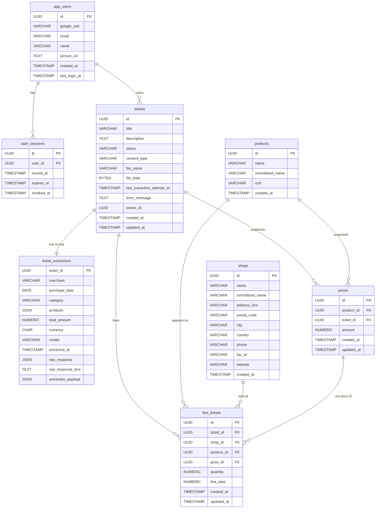

# Database schema (ERD)

> Source of truth: `persistence/src/main/resources/db/changelog/changes/V*.sql`.
> Render with any Mermaid-compatible viewer (GitHub PR preview, VSCode Mermaid extension, `mmdc`, etc.).
> Reflects state after V10 — schema in active development, keep in sync with new migrations.

## Diagram



> **Note on key markers.** Mermaid ≤ 9.x only recognises `PK` and `FK` — `UK` and
> combined `PK,FK` are rejected. UNIQUE columns are shown above without a key
> marker; the actual indexes are listed in the [Indexes](#indexes) section.
> `ticket_extractions.ticket_id` is both PK and FK (shared-PK join with
> `tickets`); shown as `PK` only for parser compatibility.
> **Note on attribute comments.** Mermaid's erDiagram attribute syntax
> (`"comment"` after the column name) is parser-fragile — special chars
> (`|`, `>=`, parens) inside comments break older renderers. Nullable
> columns, defaults, and CHECK constraints are documented in the
> per-table sections below instead.

## Per-table notes

Constraints, defaults, and nullability that the diagram can't safely express inline.

### `tickets`

- `status` — `VARCHAR(32) NOT NULL`, CHECK in `('OPEN','IN_PROGRESS','ON_ERROR','DONE','CANCELLED')` (widened in V8 to admit `ON_ERROR`).
- `content_type`, `file_name`, `file_data` — nullable (added in V3; pre-V3 rows have NULLs).
- `last_extraction_attempt_at` — nullable; populated by the scheduler on every tick (success or failure).
- `error_message` — nullable; populated when extraction fails and the ticket transitions to `ON_ERROR`. Cleared via `PATCH /api/tickets/{id}/status` to `OPEN` or `CANCELLED`.
- `owner_id` — `UUID NOT NULL`, **no FK declared** to `app_users.id` (see [Known gaps](#known-gaps--follow-ups) #1).

### `ticket_extractions`

- `ticket_id` — PK and FK to `tickets.id` ON DELETE CASCADE (shared PK = 1:1 join).
- `products` — `JSONB NOT NULL`, array of `{name, quantity, unit, price_per_unit, line_total}`; readers should treat unknown fields as forward-compatible.
- `total_amount` — `NUMERIC(12,2) NOT NULL`, CHECK `>= 0`.
- `currency` — `CHAR(3) NOT NULL DEFAULT 'EUR'`.
- `raw_response` — legacy `JSONB`, **nullable since V5**. Drop pending V6.
- `raw_response_text` — `TEXT`, populated by the application since V5.
- `extraction_payload` — `JSONB`, nullable, holds the parsed structured object (per-product discounts, VAT breakdown, totals). Added in V7; historical rows are not backfilled.

### `shops`

- `name` — `VARCHAR(255) NOT NULL`. Display name as printed on the receipt (first-seen variant wins, but the UPSERT updates the column on every re-mint so a better OCR result overwrites).
- `normalised_name` — `VARCHAR(255) NOT NULL`, UNIQUE via `uq_shops_normalised_name`. Computed by `Shop.normalisedNameOf(name)` = `name.trim().toLowerCase(Locale.ROOT)`. Match key for upsert.
- `address_line`, `postal_code`, `city`, `country`, `phone`, `tax_id`, `website` — all nullable (added in V11). Source of truth is the AI extraction payload when the prompt grows `merchant.*` fields; today the user fills them via `PATCH /api/shops/{id}`. The UPSERT uses `COALESCE(EXCLUDED.<col>, shops.<col>)` so a sparse later extraction never blanks out a richer earlier write or a manual edit.
- `country` — `CHAR(2)`, ISO 3166-1 alpha-2 (`ES`, `FR`, `PT`…). Length is enforced at the controller boundary, not the DB.
- `tax_id` — `VARCHAR(32)`. Free-form: CIF (ES), SIRET (FR), VAT (elsewhere). No per-country format validation in the domain — the user typed it, we trust it.

### `products`

- `unit` — `VARCHAR(16)`, nullable. `NULL` is treated as a distinct unit (not a wildcard) — `COALESCE(unit,'')` in the unique index makes two NULL units collide.

### `prices`

- `amount` — `NUMERIC(12,4) NOT NULL`, CHECK `>= 0`.

### `line_tickets`

- `quantity` — `NUMERIC(10,3) NOT NULL`, CHECK `> 0`.
- `line_total` — `NUMERIC(12,2) NOT NULL`.

## Cascade map

| Parent → Child | ON DELETE | Reason |
|---|---|---|
| `app_users` → `auth_sessions` | CASCADE | session ends with user |
| `tickets` → `ticket_extractions` | CASCADE | extraction is part of the ticket |
| `tickets` → `prices` | CASCADE | price snapshot anchored to ticket |
| `tickets` → `line_tickets` | CASCADE | lines belong to ticket |
| `products` → `prices` | RESTRICT | catalog integrity |
| `products` → `line_tickets` | RESTRICT | catalog integrity |
| `shops` → `line_tickets` | RESTRICT | catalog integrity |
| `prices` → `line_tickets` | RESTRICT | price is source of truth for line amount |

## Indexes

| Table | Index | Columns |
|---|---|---|
| `tickets` | `idx_tickets_status` | `status` |
| `tickets` | `idx_tickets_created_at` | `created_at DESC` |
| `tickets` | `idx_tickets_last_extraction_attempt_at` | `last_extraction_attempt_at` |
| `tickets` | `idx_tickets_owner_id` | `owner_id` |
| `auth_sessions` | `idx_auth_sessions_user` | `user_id` |
| `auth_sessions` | `idx_auth_sessions_expires` | `expires_at` |
| `ticket_extractions` | `idx_ticket_extractions_merchant` | `merchant` |
| `ticket_extractions` | `idx_ticket_extractions_purchase_date` | `purchase_date DESC` |
| `products` | `idx_products_normalised_name_unit` (UQ) | `(normalised_name, COALESCE(unit,''))` |
| `shops` | `uq_shops_normalised_name` (UQ) | `normalised_name` |
| `prices` | `idx_prices_product_ticket_amount` (UQ) | `(product_id, ticket_id, amount)` |
| `prices` | `idx_prices_ticket_id` | `ticket_id` |
| `prices` | `idx_prices_product_id` | `product_id` |
| `line_tickets` | `idx_line_tickets_ticket_product` (UQ) | `(ticket_id, product_id)` |
| `line_tickets` | `idx_line_tickets_ticket_id` | `ticket_id` |
| `line_tickets` | `idx_line_tickets_shop_id` | `shop_id` |
| `line_tickets` | `idx_line_tickets_product_id` | `product_id` |
| `line_tickets` | `idx_line_tickets_price_id` | `price_id` |

## Known gaps / follow-ups

1. **`tickets.owner_id` has no FK to `app_users.id`.** UUID is `NOT NULL` but unenforced — orphans possible. Add `FOREIGN KEY (owner_id) REFERENCES app_users(id) ON DELETE CASCADE` in a new migration when ownership cleanup matters.
2. **`ticket_extractions.raw_response` (legacy JSONB) is still present and nullable.** V5 added `raw_response_text TEXT` as the writer, but V6 (the planned drop) never landed. Code may still read from the legacy column — verify before dropping.
3. **`ticket_extractions.products` JSONB duplicates info already normalized in `products` / `prices` / `line_tickets`.** Historical rows are not backfilled; new DONE tickets go through both paths.
4. **No composite index on `(owner_id, status)`.** Dashboard "my pending tickets" filters on both columns and currently uses two separate indexes. A composite would cut the plan to one index scan.
5. **`V6` is missing from `db.changelog-master.yaml`** — the include list jumps V5 → V7. If V6 ever lands, the master changelog needs an entry.

## How to regenerate

This file is hand-maintained to stay readable. To regenerate from migrations when many change at once:

```bash
# after spinning up the local Postgres from docker-compose
pg_dump --schema-only --no-owner \
  "$(grep DB_URL .env | cut -d= -f2)" \
  > /tmp/schema.sql
# then hand-trim the output and update this doc
```

Or, for an interactive view, paste the migrations into [dbdiagram.io](https://dbdiagram.io) using DBML.